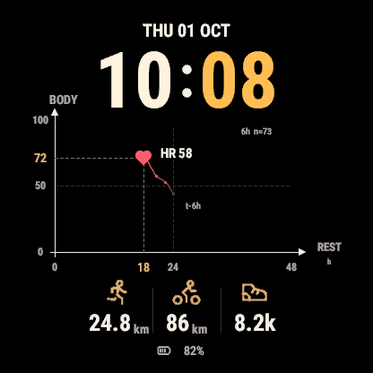
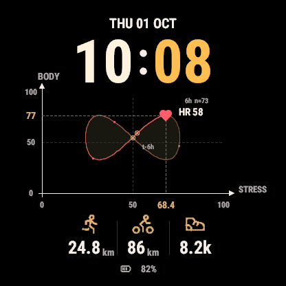

# Locus

A Garmin watch face that turns your changing physiology into a six-hour phase portrait.
Built in Monkey C for Forerunner and fēnix watches, with AMOLED and MIP display paths.

<p align="center">
  
  
</p>

Warm ivory hours, golden minutes, and a flat coral heart keep the current moment in focus.
A fine trajectory fades from the accent color toward the current point, with sparse observation
marks, subtle closed-region fills, and highlighted intersections. Weekday and date sit above
the time; device battery sits at the bottom. Screenshots use illustrative values rendered in the official simulator.

## Configuration

Configure six positions from the watch's watch-face settings or the official phone settings:

| Position | Default |
| --- | --- |
| Current point and annotation | Heart rate |
| Horizontal axis | Recovery time |
| Vertical axis | Body Battery |
| Lower left | Run distance this month |
| Lower center | Bike distance this month |
| Lower right | Today's steps |

Each position supports hidden, heart rate, recovery, Body Battery, monthly run/bike distance,
steps, device battery, stress, Pulse Ox, respiration, running/cycling VO2 max, floors, and weekly
intensity minutes. Labels, units, and icons follow the selected metric. Axes adapt their range;
changing either axis starts a new trajectory. Heart size follows heart rate within fixed bounds.

Six accent colors, 12/24-hour time, km/mi, date visibility, and always-on time are configurable.
Unavailable data shows `--`. Training readiness and sleep are not offered without a supported
public API. The separate AMOLED low-power screen displays only time. Solar/MIP watches retain the full
chart with minute updates and stronger trail contrast.

## Build and run

Install the official [Connect IQ SDK](https://developer.garmin.com/connect-iq/sdk/), put
`monkeyc` and `monkeydo` on `PATH`, and use Python 3.10+ and a developer signing key.
See [development instructions](docs/DEVELOPMENT.md) for key setup and architecture.

```sh
python3 scripts/build.py --device fr265 --release
python3 scripts/build.py --device fr265s --release
```

Outputs go to `build/locus-<device>-live.prg`. Install only the file matching your device;
files containing `demo` or `tests` are simulator fixtures, not sideload builds. To sideload,
connect the matching watch in file transfer mode, copy its PRG into `GARMIN/APPS/`, disconnect, and select **Locus** as the watch face.
[Connect IQ Store](https://apps.garmin.com/apps/510184a4-d4fb-4bbf-adcc-6ad58fa3c84e).

Start the official simulator before running the native suite:

```sh
python3 scripts/test.py
```

To inspect a deterministic simulator illustration:

```sh
python3 scripts/build.py --preview
monkeydo build/locus-fr265-demo-normal.prg fr265
```

Add `--scenario loops`, `missing`, `extreme`, or `aod` to exercise the corresponding scene.
Run SDK builds and simulator sessions serially. Fixtures and native tests are excluded from
production builds; all generated output is ignored by Git.

## Data and limits

Live metrics come from Garmin's native Complications API. Running and cycling distances are
summed from saved activities exposed by `UserProfile.getUserActivityHistory()` for the current
local calendar month, by activity start time and sport (running or cycling). The shoe shows
today's step count, including steps taken while running, rather than walking distance.
Monthly totals refresh on return to the face and at most every five minutes while active,
and reset at the local month boundary. They cover history available on this watch; activities
from other devices or deleted history may be absent even when present in Garmin Connect.
There is no network service or account.
Trajectory observations are stored locally, bounded to 73 samples over six hours. They are
collected during normal active updates, at most once every five minutes. AMOLED low-power mode
does not sample athlete data. Gaps longer than 15 minutes remain disconnected, so this is an observed
history rather than guaranteed continuous background monitoring.

Supported device profiles are declared once in `manifest.xml`; both build and test commands
read that list. `python3 scripts/test.py` verifies every declared profile serially.

| Family | Variants | Display |
| --- | --- | --- |
| Forerunner 265 | 265, 265S | AMOLED, 416 / 360 px |
| Forerunner 570 | 42 / 47 mm | AMOLED, 390 / 454 px |
| Forerunner 965 / 970 | Both | AMOLED, 454 px |
| fēnix E | 47 mm | AMOLED, 416 px |
| fēnix 8 | 43 / 47 / 51 mm; Pro / MicroLED | AMOLED / MicroLED, 416 / 454 px |
| fēnix 8 Solar | 47 / 51 mm | MIP, 260 / 280 px |
| fēnix 9 | 43 / 47 / 51 mm | AMOLED, 416 / 454 px |
| fēnix 9 Pro | 43 / 47 / 51 mm | AMOLED, 416 / 454 / 466 px |
| fēnix 9 Pro Solar | 47 / 51 mm | MIP, 260 / 280 px |

Garmin also groups corresponding tactix 8 and quatix 8 variants under the fēnix 8 device
profiles. See the official [device list](https://developer.garmin.com/connect-iq/compatible-devices/).
Native simulator tests and screenshots are separate from physical-device and battery-life testing.

## License

Project code is [MIT licensed](LICENSE). Metric icons use official
[Tabler Icons](https://github.com/tabler/tabler-icons) paths, with their
[MIT license](resources/icons/tabler/LICENSE) and pinned
[provenance](resources/icons/tabler/provenance.json) included.
